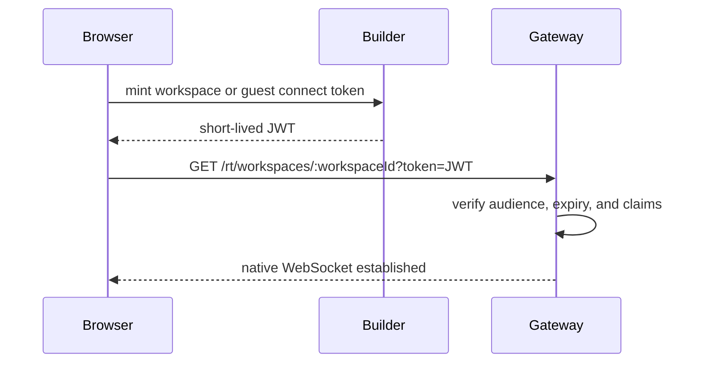
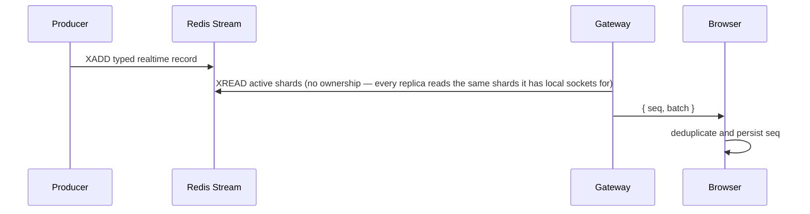

# WebSocket transport

## Browser connection

## Event delivery

The WebSocket is a replayable projection. The database remains authoritative;
a client that detects a gap or receives a resync close fetches its current
conversation head and active thread.
